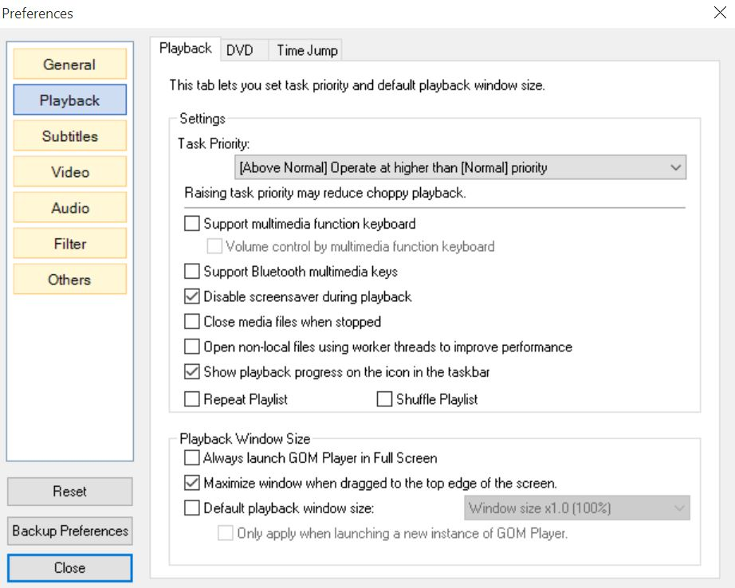

## GOM Installation
You can download GOM Media Player from the [GOM website](http://player.gomlab.com/eng).

Disable the option Default Playback Windows Size so that GOM Media Player will only take up the right side of your screen.  You will have to move GOM there “manually”; it does not work to drag GOM there on the title bar to resize it to half of the screen.

