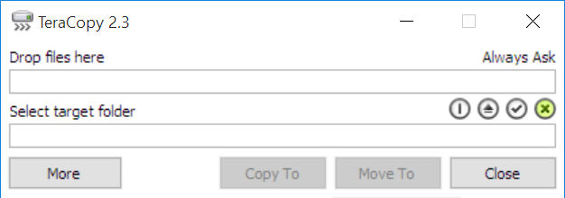

## TeraCopy Installation

You can find more information about TeraCopy on the [TeraCopy website](http://codesector.com/teracopy).

> TeraCopy is designed to copy and move files at the maximum possible speed. It skips bad files during the copying process and then displays them at the end of the transfer so that you can see which ones need attention. TeraCopy can automatically check the copied files for errors by calculating their CRC checksum values. It also provides a lot more information about the files being copied than its Windows counterpart. TeraCopy integrates with Windows Explorer's right-click menu and can be set as the default copy handler.

MFM uses TeraCopy to do the actual copying or moving.

Install TeraCopy with the default settings and change them later as shown below if wanted.  
To make sure TeraCopy all the time starts copying, uncheck “Check Free Space” in the Preferences.  You can open the Preferences by right-clicking somewhere in the TeraCopy window and selecting Preferences...  
If you do not want that TeraCopy replaces the operating system copy function, uncheck Use TeraCopy as Default Copy Handler.

