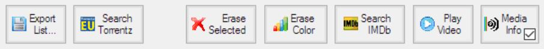
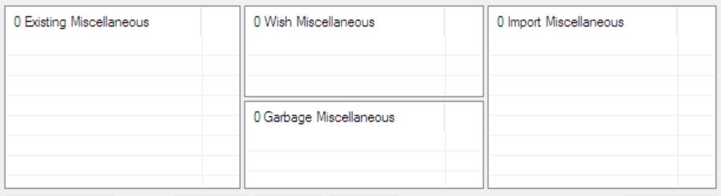
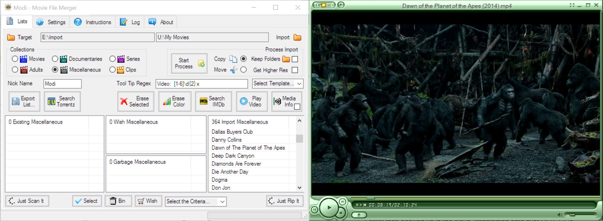
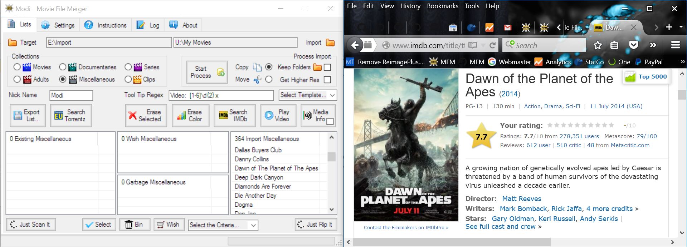
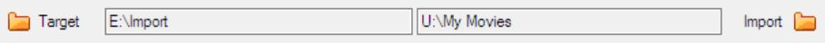

# MFM Usage
The video selection process is supported by Garbage, Existing and Wish lists.  Items are colored, so that you can concentrate on the difference of the collections.  Items to be processed can be selected from the lists, which have been previously generated by MFM, without the presents of the actual files.  Additional information about the items can be searched on IMDb.  After the selection has been done, MFM can be connected to the hard disks and the actual processing started.  Items that do not need to be considered can be erased from the Import list, because MFM is designed so that the Import list can be scanned in newly quite fast or reloaded.  MFM does not rename, delete or modify any files, just copy or move them.

MFM is designed to work together with or beside several other programs...  See the MFM Usage and Installation section for details about their usage, installation and setup.  For more details about the usage of third party programs please consult the according user manuals.  The best way is to split the screen in two halves, put MFM on the left hand side and the other program on the right hand side.  Drag windows on their title bar, either to the left or to the right edge, to automatically resize the window to half of the screen.

Here are some explanations about terms and how they are used in conjunction with MFM...  A Collection Type is the main type of the items which you want to process at this moment.  An item is the sum of combined files belonging to a name.  A list is a collection of items with similar properties.  Names are reduced and standardized, to make it easier to match items.  Items are shown in the lists.  A Drop Area is an area where you can drop an item or items to perform various actions on them.  An episode identifier is the part of the files name which tells MFM which episode is a file in which season of a series.

When you change the collection type or exit MFM, MFM will ask you if it should save changed lists to your hard disk.  There is no undo function in MFM, so save your lists from time to time and if something goes wrong just discard the recent changes.

## Basic Steps
Create a list of your existing items, by adding all top level folders of one collection type on all your hard disks to the Existing list.  Save the Existing list, by switching to another collection type.  Use Save List As... to export the list for later processing or as a backup.

Get an Import folder or a list from Dropbox, so that you can see which items you have and which garbage are.  Erase the existing and garbage items from the Import list, so that only new items and wish items are left in the Import list.

Mark the new items as Garbage if you don’t want to have them or as Wish to process them if they should be copied or moved to the Target folder.  Save the Garbage and the Wish lists.

To process your items, select if you want to copy or move the items to process from the Import folder.  Check Keep Folders if the folder structure in the Import folder should be kept.  To flatten the folder structure, uncheck Keep Folders.  Click on the progress bar to process the items.  Wait until the processing is finished.
Repeat the procedure until no new items are left in the Import list.

## Select the Collection Type
A collection is the sum of items, which match certain criteria, like Movies, Documentaries or Series.  Try to keep the collections in separate top level folders on your hard disks, to make your life easier when processing your collections.

The Series collection type is treated differently from the other collection types, since its items should have an episode identifier in the file name.  The item names of episodes are cute after the episode identifier in the Garbage and to the Wish lists, which tells MFM that a series is garbage or you want to have it.  In the Existing and the Import list, the items names are cut after the episode identifier, so that MFM can find out which episode are missing.

All other collections are treated like the Movies collection.  Item names are usually cute before the year, so that they can be compared easier.

You can set how exactly the item names are unified in the settings.  To make the lists better comparable between different users it is recommended that the settings are changed as little as possible.

## Use the Drop Areas

Drop items from the lists on the drop areas to perform actions on them, like save a list, search the internet, erase items for a list, play the video, or get detailed video format information.

### Export List
Drop a single item from any list here to export the complete list.  The exported list can then be imported again by dropping it on any list.  Use Export List to share your lists over Dropbox or make your own backup.  The working lists do not have to be exported, since they are saved automatically by MFM in your MFM Private folder.

### Search Torrentz
Drop a single or multiple items here to search for the titles on Torrentz.eu.  Your default web browser will be used for the search.  To do the actual download, you have to install a torrent client like uTorrrent.

### Erase Color
Drop a single item of any list here to erase all items of the same colour from the list.  You can for example erase all Garbage movies from your Existing list or you can erase all existing movies from the Wish list after they have been processed.  To shorten the Import list and ease the selection process, you can erase all Garbage, Existing, and Wish items, because the Import list can be reloaded once the selection process is finished.

### Erase Selected
Drop an item or an item selection here to erase all selected items from a list.  You can select multiple items with the mouse by clicking in the empty column to the right of the item title column.  If you use the keyboard, you can select multiple items with the Shift key.  Single selected items can also be deleted with the Delete key.  Use Erase Selected to clear a complete list, be selecting all if the items with the mouse.

### Search IMDb
Drop an item or an item selection here to search for the titles on IMDb.  You can select multiple items with the mouse by clicking in the empty column to the right of the item title column.  You can also double click a single item in any list to search for the title on IMDb.  Your default web browser will be used to perform the internet search.

### Play Video
Drop a single item from the Import list here to play the video.  If MFM does not find the video file in the Import folder nothing happens.  Your default media player will be used to play the video.  If the Import folder is available, Play Video is probably the most effective way to know what you get.

### MediaInfo – ALL Check Box
Drop an item selection from the Import list here to show the detailed media information with MediaInfo.  If MFM does not find the video files in the import folder nothing happens.  You have to install MediaInfo first to enable this option.
If the All check box is checked, more detailed information will be added to the popup info, when you drop a file or folder in the lists.  The popup info will be shown when you hover with the mouse over an item.  Check ALL before you update your Existing list and export them, so that other people have more information about the quality of the items.  To read the additional information takes considerable time.  To significantly speed up the processing, uncheck the ALL check box, so that only the basic information has to be read.

## Use the Lists

Each collection is split into 3 lists.  The Garbage, Existing, and Wish lists are stored in a collection.  A list is the sum of all items of a certain collection type, which match certain criteria, like you don’t want to have them, you have them, or you want to have them.  The Import list items are not stored in the collections, but have to be imported new each time from a folder or an exported list.

The Garbage list is the collection of items, which you do not want to have.  It includes also misspelled names.  The Existing list is the collection of items, which you have.  It can include also garbage items.  The Wish list is the collection of items, which you want to have.  The Wish list can include also Garbage and Existing items.  The Import list is the collection of items, which are available from an exported list or a folder on the hard disk.

If you hover the mouse over a list item a pop-up info is shown containing information about the item, like file size, file name, or resolution… What is shown depends on the how the item is scanned or if it comes from a precompiled list.

The lists are handled by selecting items and performing the desired action on them.  To select multiple items with the mouse, use the right most column (no header, quite thin and empty) and move the mouse over all items, which should be selected.

To add items to a list from a top level folder, drag the folder from the Windows Explorer and drop it on the list.  The add items from an exported list to a list, drag the exported list from the Windows Explorer and drop it on any list.  The pop-up info of items in the list will not be overwritten and only new items added to the list.  Only relevant unified items are added to a list when the items are read from a folder.  Unified items means that if there are more files for the same item, like a video file and a subtitle file, only one entry will be shown in the list.  MFM tries to keep the item names short to make them easier to read and to compare.  Files which are not relevant for MFM will not be shown in the lists.

All lists are drop areas, for items, for list exports and for folders.  To move items from one list to another, drag and drop items from one list to another list.  To delete items from a list, select them and press the Delete key.  Only the lists are changed, but the files still remain where they are.
If the collection type is changed or MFM closed it will ask you if you want to save any changed lists, except the Import list.

MFM uses unified item names and combines different file types, to make the processing easier.  The rules how to unify the items names can be set with regular expressions in the Setting tab.
Note:  You should organize your stuff in folders according to the collection types like Movies, Series, or Documentaries to make it easier to populate the lists.

### Garbage List
Garbage items are colored red.  The Garbage list contains all items you don’t want to have and probably don't have on any of your hard disks.  To put an item in the Garbage list can mean also that the name is spelled wrong or that it is in the wrong collection category.  It does not necessarily mean that the movie itself is garbage.  To add items to the Garbage list drag and drop items from any other list.
Note:  It the Collection Type Series is selected, only the titles of the series are shown, but not the individual files.  In order to make this work a valid Episodes Identification has to be contained in the file names.

### Existing List
Existing items are colored dark green.  The Existing list contains the items you have on your hard disks.  To add items to the Existing list drag and drop the top level folders from the Windows Explorer on the Existing list.  After a while your Existing list will get out of sync with the stuff you actual have.  To get an up to date Existing list erase all items and populate the list again with the top level folders from your hard disks.

### Wish List
Wish items are colored light green.  The Wish list contains items you want to have. To add items to the Wish list drag and drop items from the Import list on the Wish list.  After you have copied the items they will appear in the Wish list.  To clean up the Wish list, erase the Garbage and Existing items.
Note:  It the Collection Type Series is selected, only the titles of the series are shown, but not the individual files.  In order to make the work a valid Episodes Identification has to be contained in the file name.

### Import List
The Import list contains all the items, which should be processed and is a mixture of Existing, Garbage and New items, to combine with your existing collection.  To prepare the processing populate the Import list from previously saved .csv files.  Move the items to the other lists and save them for later processing. To start the actual processing the Import list has to be populated from a folder on a connected hard disk.

## MFM and Dropbox
Some information from https://www.dropbox.com is shown here.  "One place for all your stuff, wherever you are."  Dropbox is a home for all your photos, docs, videos, and files.  Anything you add to Dropbox will automatically show up on all your computers, phones and even the Dropbox website — so you can access your stuff from anywhere.  Dropbox also makes it super easy to share with others, whether you're a student or professional, parent or grandparent.  Even if you accidentally spill a latte on your laptop, have no fear!  Relax knowing that your stuff is safe in Dropbox and will never be lost.

MFM is designed to be executed as a whole in Dropbox.  Use Dropbox to share your lists with your friends.  Dropbox is best used to the right side of MFM in the Windows Explorer.  Basically there are three folders in Dropbox, which are relevant for MFM...

MFM Program – Contains files need for the execution of MFM.  To start MFM double click on Movie File Merger.exe.  Create a shortcut on your desktop of easy access of MFM.

MFM Private – Contains your private copy of the initialization file and your collections, which are loaded be default from MFM.  The first time your start MFM it will create this folder at the same level of the MFM Program folder.  It contains also the TeraCopy Lists folder, where MFM stores the lists, which have been previously processed.

MFM Collection – Contains the collections for sharing and is the standard folder for MFM.  Export and import lists here to share with your friends.  You can make as many independent collections folders as you want and share with different groups of friends.

To manage your Dropbox, click on the Dropbox item in the Windows System Tray and select Dropbox.com.  You can then invite other people to your collection folder.

Use Windows Explorer to drag and drop folders or list files into MFM.  I would recommend you to place Windows Explorer to the right of MFM.  To place a window so that it occupies half of the screen, drag it on the title bar to the very right or left side of the screen.

[(../images/MFM_Dropbox1.jpg)

MFM uses just a few percent of the free Dropbox online storage, so that you can use Dropbox also for other things, like sharing your photos with your friends, which is much, much easier over Dropbox then over e-mail. Note also that every time you recommend a new user for Dropbox your and their free on-line storage will be increased by 500 MB to a maximum of 16 GB.  All you need is the e-mail of your friend, for which Dropbox should be registered.

## MFM and GOM

You can find more information about GOM Media Player on http://player.gomlab.com/eng.  Not only is GOM Media Player a completely FREE video player, with its built-in support for all the most popular video and audio formats, tons of advanced features, extreme customizability, and the Codec Finder service, GOM Media Player is sure to fulfil all of your playback needs. With millions of users in hundreds of countries, GOM Media Player is one of the world`s most popular video players.

Use GOM Media Player (or any other player of your choice) to view a video.  Drag an item from the Import list on Play Video.  MFM searches for the item in the Import Folder, if MFM does not find the item nothing will happen.

To use a player is probably the most effect method to get more information about the actual video, since you can judge the quality and content yourself.

## MFM and IMDb

You can find more information about IMDb on http://www.imdb.com.  The Internet Movie Database (IMDb) is an online database of information related to films, television programs, and video games. This includes actors, production crew personnel, and fictional characters featured in these three visual entertainment media.

Use IMDb to get additional information about movies, series, or documentaries.  Further, you can also export lists from IMDb, process them a little bit in MS Excel and drop them into your MFM lists.

Firefox (or any other web browser, depending on what you have set in your system settings) is used to search IMDb.  Firefox is Ok to run either on the left or the right side of MFM.

Whole categories of movies, downloaded from IMDb, can be added to the Garbage list.  For example export a list with Sport movies from IMDb, open the exported list with MS Excel, delete not wanted columns, make the title column the first column and then save the file as tabulator delimited text file.  Drop the file in your Garbage list.  The first column will be used as item title; the other columns will be added to the popup info.  If you like Sci-fi movies then you can drop the Sci-fi list in your Wish list and whenever MFM find a Sci-fi movie it will be copied.

## Set the Folders

There are two folders, which are relevant for the processing of files, the Target and the Import folder.  When you click the progress bar the files which match the Wish items in the Import list are copied or moved from the Import folder to the Target folder.

### Target Folder
The Target folder is the folder where you want to copy or move your wish movies to.  Drop a folder from the Windows Explorer into the text field beside the Target folder icon.

If items are found in the Target folder they are added to the Existing list.  It is recommended to make a folder structure in your target folder similar to the collection types you are processing.  For example you could have a Movies, a Documentaries, and a Series folder in the Target folder.

### Import Folder
The import folder is set automatically when you drop a folder or file in the Import list.  If a file or multiple folders are dropped in the Import list the according top level folder is used.  If you drop a folder in the text field to the left of the Import icon the import list is automatically populated.

## Process the Import

The process Import section allows you to copy or move the actual video and subtitle files.  You have to install TeraCopy to do the actual processing.  See the Installation section how to setup TeraCopy so that it does not replace the default Windows copy or move.

### Copy
If Copy is selected and you click the Progress Bar, the Wish colored items in the Import list will be copied to the Target folder.  Actually, MFM does not do the copying, but just prepares a list which it hands over to TeraCopy.  As soon as MFM has handed over the list, you can continue selecting the items you want to process next.  You can start the next copy process even if TeraCopy is still running.  New items will be added the TeraCopy waiting list and processed when the time has come.

### Move
If Move is checked and the Progress Bar clicked, the Wish colored items in the Import list will be moved to the Target folder.  Actually, MFM does not do the moving, but just prepares a list which it hands over to TeraCopy.  As soon as MFM has handed over the list, you can continue selecting the items you want to process next.  You can start the next moving process even if TeraCopy is still running.  New items will be added the TeraCopy waiting list and processed when the time has come.

### Keep Folders
If Keep Folders is checked the folder structure of the Import folder will be recreated in the Target folder.  Only folders which contain items that are copied or moved are created.  To keep the keep the folder structure is especially useful for series.  For movies I would recommend to flatten the folder structure.

### Progress Bar
Click the progress bar to start the processing.  MFM will create list files and hand them over to TeraCopy, which does the actual copying or moving.  As soon as MFM has handed over the list, you can continue selecting the items you want to process next.

## MFM and MediaInfo

You can find more information about MediaInfo on http://mediainfo.sourceforge.net.  MediaInfo is a convenient unified display of the most relevant technical and tag data for video and audio files.

Use MediaInfo to get detailed information about the video files.

Drag an item from the Import list on MediaInfo...  MFM searches for the item in the Import Folder, it MFM does not find the item nothing will happen.

## MFM and PVD

You can find more information about PVD on http://www.videodb.info/forum_en.  With Personal Video Database you can catalogue your movie collection fast and easy. Thought-out user interface and different database management function make it easy to create and manage big movie databases. Powerful filtering, grouping and sorting help you find movies very fast.

Use Personal Video Database to generate lists of movies according to certain filter criteria or to rename movies to their standard names.  It is important that movies have good names, preferably from IMDb.

With advanced filter you can setup complex criteria, and then export the list.  Clean up the exported list, with a text editor like Notepad++, so that only the movie names are in the list, and then drop it into MFM.

## MFM and Torrentz

You can find more information about Torrentz on http://torrentz.eu/

1. Torrentz is a meta-search engine (aggregator) and a Multisearch. This means we just search other search engines.

2. Torrentz is a very powerful internet location search tool.

3. Torrentz is neither a torrent cache, torrent tracker nor a torrent directory.

4. Torrentz does not host or "make available" any files or torrents in any way, shape or form.

5. Torrentz links to other independent search engines that might host torrent files. We have absolutely no control over those domains.

6. Indexing process is completely automated. We don't check it. Whatever the stupid bots suck in goes. The good, the bad and the ugly.

7. Torrent files are simply metadata and cannot be copyrighted.

8. We don't host torrents; we don't even save torrents for ourselves after the filename and size extraction.

9. Torrentz is similar to Google.

10. Torrentz will gladly remove any links at copyright owner's request. Read Takedown Policy below.

11. Torrentz has been around for well over 9 years now.

12. Torrentz has a spotless relationship with copyright owners and governmental organizations (Child protection, etc).

13.	Torrentz respects reasonable copyrights and acts in compliance with EUCD and DMCA. Yes, Really.

14.	Torrentz loves you.

Use Torrentz to download any video you want to have immediately.  Drag an item from the Import list on Search Torrentz.

## Share Rings

You can open share rings with your friends, to distribute videos.  A share ring is a group of people, who live in same area, can meet each other, and have a video collection on their hard disk or disks.  Each member of a share ring scans its own videos with MFM and distributes the lists in the MFM Collection folder in Dropbox.  Other members can then preselect the videos they want to copy at home and put them into their Wish lists.  Once the hard disks are brought together, MFM extracts only the wanted videos from your friend’s hard disk.

The MFM Collection folder is used as default from MFM.  If you want to open another share ring with a different group of people just make another folder and put your lists in there.  There is no limitation concerning the amount of collection folders you can have.  One member of the share ring will be the owner of the shared folder in Dropbox, with the right to exclude people if needed.  As default from Dropbox every member can invite other people.  However, the owner of the Dropbox folder can disable that option.

Since all members of a share ring compare their list with each other it is quite important to use the same naming conventions and item unification settings.

Since it is a lot of work to select videos, precompiled lists (with thousands of entries) can be downloaded from IMDb.  The precompiled lists can be for genres, like sci-fi, romance, drama action...  If you put a precompiled list in your wish folder MFM searches for videos of all genres in the wish list.  Some precompiled lists are also provided with the MFM installation.
