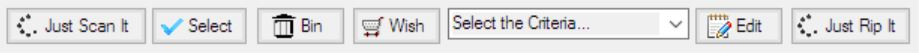
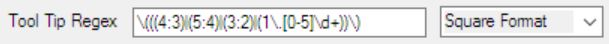
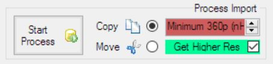

# List Tab

The Lists tab is the main tab to combine video collections. Use it to move items around in the different lists and sort your collection. 

## Use the Lists

Each collection is split into 3 lists.  The Garbage, Existing, and Wish lists are stored in a collection.  A list is the sum of all items of a certain collection type, which match certain criteria, like you don’t want to have them, you have them, or you want to have them.  The Import list items are not stored in the collections, but have to be imported new each time from a folder or an exported list.

The Garbage list is the collection of items, which you do not want to have.  It includes also misspelled names.  The Existing list is the collection of items, which you have.  It can include also garbage items.  The Wish list is the collection of items, which you want to have.  The Wish list can include also Garbage and Existing items.  The Import list is the collection of items, which are available from an exported list or a folder on the hard disk.

If you hover the mouse over a list item a pop-up info is shown containing information about the item, like file size, file name, or resolution… What is shown depends on the how the item is scanned or if it comes from a precompiled list.

The lists are handled by selecting items and performing the desired action on them.  To select multiple items with the mouse, use the right most column (no header, quite thin and empty) and move the mouse over all items, which should be selected.

To add items to a list from a top level folder, drag the folder from the Windows Explorer and drop it on the list.  The add items from an exported list to a list, drag the exported list from the Windows Explorer and drop it on any list.  The pop-up info of items in the list will not be overwritten and only new items added to the list.  Only relevant unified items are added to a list when the items are read from a folder.  Unified items means that if there are more files for the same item, like a video file and a subtitle file, only one entry will be shown in the list.  MFM tries to keep the item names short to make them easier to read and to compare.  Files which are not relevant for MFM will not be shown in the lists.

All lists are drop areas, for items, for list exports and for folders.  To move items from one list to another, drag and drop items from one list to another list.  To delete items from a list, select them and press the Delete key.  Only the lists are changed, but the files still remain where they are.
If the collection type is changed or MFM closed it will ask you if you want to save any changed lists, except the Import list.

MFM uses unified item names and combines different file types, to make the processing easier.  The rules how to unify the items names can be set with regular expressions in the Setting tab.
Note:  You should organize your stuff in folders according to the collection types like Movies, Series, or Documentaries to make it easier to populate the lists.

### Garbage List
Garbage items are colored red.  The Garbage list contains all items you don’t want to have and probably don't have on any of your hard disks.  To put an item in the Garbage list can mean also that the name is spelled wrong or that it is in the wrong collection category.  It does not necessarily mean that the movie itself is garbage.  To add items to the Garbage list drag and drop items from any other list.
Note:  It the Collection Type Series is selected, only the titles of the series are shown, but not the individual files.  In order to make this work a valid Episodes Identification has to be contained in the file names.

### Existing List
Existing items are colored dark green.  The Existing list contains the items you have on your hard disks.  To add items to the Existing list drag and drop the top level folders from the Windows Explorer on the Existing list.  After a while your Existing list will get out of sync with the stuff you actual have.  To get an up to date Existing list erase all items and populate the list again with the top level folders from your hard disks.

### Wish List
Wish items are colored light green.  The Wish list contains items you want to have. To add items to the Wish list drag and drop items from the Import list on the Wish list.  After you have copied the items they will appear in the Wish list.  To clean up the Wish list, erase the Garbage and Existing items.
Note:  It the Collection Type Series is selected, only the titles of the series are shown, but not the individual files.  In order to make the work a valid Episodes Identification has to be contained in the file name.

### Import List
The Import list contains all the items, which should be processed and is a mixture of Existing, Garbage and New items, to combine with your existing collection.  To prepare the processing populate the Import list from previously saved .csv files.  Move the items to the other lists and save them for later processing. To start the actual processing the Import list has to be populated from a folder on a connected hard disk.

## Select the Collection Type
A collection is the sum of items, which match certain criteria, like Movies, Documentaries or Series.  Keep the collections in separate top level folders on your hard disks, to make your life easier when processing your collections and use Just Scan It.

The Series collection type is treated differently from the other collection types, since its items should have an episode identifier in the file name.  The item names of episodes are cute before the episode identifier in the Garbage and the Wish lists, which tells MFM that don;t want to want to have a complete series.  In the Existing and the Import list, the items names are cut after the episode identifier, so that MFM can find out which episode are missing.

All other collections are treated like the Movies collection.  Item names are cut before the year, so that they can be compared easier.

You can set how exactly the item names are unified in the settings.  To make the lists better comparable between different users it is recommended that the settings are changed as little as possible.

## Set the Folders

There are two folders, which are relevant for the processing of files, the Target and the Import folder.  When you click Start Process the files which match the Wish items in the Import list are copied or moved from the Import folder to the Target folder.

### Target Folder
The Target folder is the folder where you want to copy or move your wish movies to.  Drop a folder from the Windows Explorer into the Existing list to set the Target Folder. If items are found in the Target folder they are added to the Existing list.

### Import Folder
The Import folder is set automatically when you drop a folder or file in the Import list.  If a file or multiple folders are dropped in the Import list the according top level folder is used.

## Use the Drop Areas

Drop items from the lists on the drop areas to perform actions on them, like save a list, search the internet, erase items for a list, play the video, or get detailed video format information.

### Export List
Drop a single item from any list here to export the complete list.  The exported list can then be imported again by dropping it on any list.  Use Export List to share your lists over Dropbox or make your own backup.  The working lists do not have to be exported, since they are saved automatically by MFM in your MFM Private folder.

### Search Torrentz
Drop a single or multiple items here to search for the titles on Torrentz.eu.  Your default web browser will be used for the search.  To do the actual download, you have to install a torrent client like uTorrrent.

### Erase Color
Drop a single item of any list here to erase all items of the same colour from the list.  You can for example erase all Garbage movies from your Existing list or you can erase all existing movies from the Wish list after they have been processed.  To shorten the Import list and ease the selection process, you can erase all Garbage, Existing, and Wish items, because the Import list can be reloaded once the selection process is finished.

### Erase Selected
Drop an item or an item selection here to erase all selected items from a list.  You can select multiple items with the mouse by clicking in the empty column to the right of the item title column.  If you use the keyboard, you can select multiple items with the Shift key.  Single selected items can also be deleted with the Delete key.  Use Erase Selected to clear a complete list, be selecting all if the items with the mouse.

### Search IMDb
Drop an item or an item selection here to search for the titles on IMDb.  You can select multiple items with the mouse by clicking in the empty column to the right of the item title column.  You can also double click a single item in any list to search for the title on IMDb.  Your default web browser will be used to perform the internet search.

### Play Video
Drop a single item from the Import list here to play the video.  If MFM does not find the video file in the Import folder nothing happens.  Your default media player will be used to play the video.  If the Import folder is available, Play Video is probably the most effective way to know what you get.

### Media Info
Drop an item selection from the Import list here to show the detailed media information with MediaInfo.  If MFM does not find the video files in the import folder nothing happens.  You have to install MediaInfo first to enable this option.
If the check box is checked, more detailed information will be added to the popup info, when you drop a file or folder in the lists.  The popup info will be shown when you hover with the mouse over an item.  Check the checkbox before you update your Existing list and export them, so that other people have more information about the quality of your items.  To read the additional information takes considerable time.  To significantly speed up the processing, uncheck the check box, so that only the basic information has to be read.

## Action Bar
The purpose of the action bar is to simplify basic actions.  Al actions can be done manually, if wanted.

### Just Scan It
Just Scan It searches in the top level folder of your connected hard disks for folders containing a collection type (Adult, Movies, Documentaries, Series, or Clips) in the name.

### Select
When you click Select all entries in all lists matching the criteria to the right side are selected.

### Bin
When you click Bin all entries in the Existing, Wish and Import List are moved into the Garbage list.

### Wish
When you click Wish all entries in the Import list are selected and copied into the Wish list.

### Just Rip It
Just Rip it rips everything in the Import folder and copies or moves it to the Target folder, according the the Processing options.

## Tool Tip Regex
The Tool Tip Regex area is there to search in the tool tips, which pop up when you hover with the mouse over a list entry.  To search a list simply take an entry of the list you want to search and drop it on the regular expression.  All entries matching the regular expression will be selected in the list.

Regular expressions can be very complicated, but basic regular expressions are not that complicated and it should be possible to figure out how they work by looking at the examples. Regular expressions can be tested on the [Rubular website](http://rubular.com).

Some examples are listed in the drop down list to the right of the entry field.

## Process the Import

The process Import section allows you to copy or move the actual video and subtitle files.  You have to install TeraCopy to do the actual processing.  See the Installation section how to setup TeraCopy so that it does not replace the default Windows copy or move.

### Start Process
Click the Start Process button once you have made your other selections to start the processing.  MFM will create list files and hand them over to TeraCopy, which does the actual copying or moving.  As soon as MFM has handed over the list, you can continue selecting the items you want to process next.

### Copy
If Copy is selected and you click the Progress Bar, the Wish colored items in the Import list will be copied to the Target folder.  Actually, MFM does not do the copying, but just prepares a list which it hands over to TeraCopy.  As soon as MFM has handed over the list, you can continue selecting the items you want to process next.  You can start the next copy process even if TeraCopy is still running.  New items will be added the TeraCopy waiting list and processed when the time has come.

### Move
If Move is checked and the Progress Bar clicked, the Wish colored items in the Import list will be moved to the Target folder.  Actually, MFM does not do the moving, but just prepares a list which it hands over to TeraCopy.  As soon as MFM has handed over the list, you can continue selecting the items you want to process next.  You can start the next moving process even if TeraCopy is still running.  New items will be added the TeraCopy waiting list and processed when the time has come.

### Keep Folders
If Keep Folders is checked the folder structure of the Import folder will be recreated in the Target folder.  Only folders which contain items that are copied or moved are created.  To keep the keep the folder structure is especially useful for series.  For movies I would recommend to flatten the folder structure.

### Get Higher Res
If Ger Higher Res is checked videos found with a higher resolution than the existing videos will be also copied.  Later you can replace the existing lower resolution videos with the higher (and normally better quality) ones.  Note: to make that option work best, you should scan your existing videos with the MediaInfo option checked.
