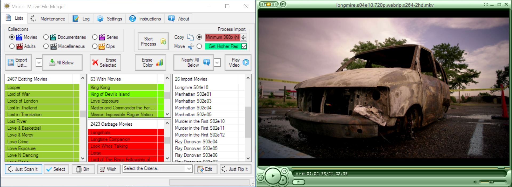

## MFM & GOM

You can find more information about GOM Media Player on the [GOM website](http://player.gomlab.com/eng).
> Not only is GOM Media Player a completely FREE video player, with its built-in support for all the most popular video and audio formats, tons of advanced features, extreme customizability, and the Codec Finder service, GOM Media Player is sure to fulfil all of your playback needs. With millions of users in hundreds of countries, GOM Media Player is one of the world`s most popular video players.

Use GOM Media Player (or any other player of your choice) to view a video.  Drag an item from the Import list on Play Video.  MFM searches for the item in the Import Folder, if MFM does not find the item nothing will happen.

To use a player is probably the most effect method to get more information about the actual video, since you can judge the quality and content yourself.

