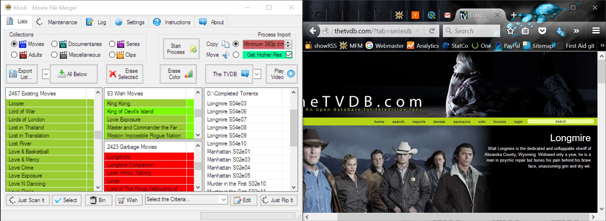

## MFM & Web Info

You can find more information about the movies or series on the web, like for example on IMDb or The TVDb websites.

>The Internet Movie Database (IMDb) is an online database of information related to films, television programs, and video games. This includes actors, production crew personnel, and fictional characters featured in these three visual entertainment media.

Use the web to get additional information about movies, series, or documentaries.  Further, you can also export lists from IMDb, process them a little bit in MS Excel and drop them into your MFM lists.

Firefox (or any other web browser, depending on what you have set in your system settings) is used to search the web.

Whole categories of movies, downloaded from IMDb, can be added to the Garbage list.  For example export a list with Sport movies from IMDb, open the exported list with MS Excel, delete not wanted columns, make the Title column the first column and then save the file as tabulator delimited text file.  Drop the file in your Garbage list.  The first column will be used as item title; the other columns will be added to the popup info.  If you like Sci-fi movies then you can drop the Sci-fi list in your Wish list and whenever MFM finds a Sci-fi movie it will be copied.
