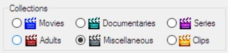

## Select the Collection Type
A collection is the sum of items, which match certain criteria, like Movies, Documentaries or Series.  Try to keep the collections in separate top level folders on your hard disks, to make your life easier when processing your collections.

The Series collection type is treated differently from the other collection types, since its items should have an episode identifier in the file name.  The item names of episodes are cute after the episode identifier in the Garbage and to the Wish lists, which tells MFM that a series is garbage or you want to have it.  In the Existing and the Import list, the items names are cut after the episode identifier, so that MFM can find out which episode are missing.

All other collections are treated like the Movies collection.  Item names are usually cute before the year, so that they can be compared easier.

You can set how exactly the item names are unified in the settings.  To make the lists better comparable between different users it is recommended that the settings are changed as little as possible.

