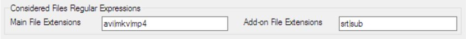

# MFM Settings

The Settings tab contains all settings to adjust MFM to the style of your collection. Anyway, if you follow my style, then there should not be too much need to change any of the settings.

Most of the settings are regular expressions.  See the chapter Regular Expressions at the end of MFM Settings for more information.

## Considered Files Settings
MFM only considers files which have certain extensions.  Files which are not relevant are ignored.

### Video Files Extension
The Video Files Extension regular expression identifies main video files.  If no main file exists also the add-on files will be ignored.  Keep the list as short as possible to speed up the file processing.  Add all wanted video file extensions separated with a vertical line `|`.

### Add-on Files Extension
The Add-on Files Extension identified add-on files like subtitles or posters.  Add-on files will be only considered if a main video file exists.  Add all wanted add-on file extensions separated with a vertical line `|`.

