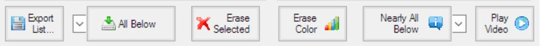

## Use the Drop Areas

Drop items from the lists on the drop areas to perform actions on them, like save a list, search the internet, erase items for a list, play the video, or get detailed video format information.

### Export List
Drop a single item from any list here to export the complete list.  The exported list can then be imported again by dropping it on any list.  Use Export List to share your lists over Dropbox or make your own backup.  The working lists do not have to be exported, since they are saved automatically by MFM in your MFM Private folder.

### Search Torrentz
Drop a single or multiple items here to search for the titles on Torrentz.eu.  Your default web browser will be used for the search.  To do the actual download, you have to install a torrent client like uTorrrent.

### Erase Color
Drop a single item of any list here to erase all items of the same colour from the list.  You can for example erase all Garbage movies from your Existing list or you can erase all existing movies from the Wish list after they have been processed.  To shorten the Import list and ease the selection process, you can erase all Garbage, Existing, and Wish items, because the Import list can be reloaded once the selection process is finished.

### Erase Selected
Drop an item or an item selection here to erase all selected items from a list.  You can select multiple items with the mouse by clicking in the empty column to the right of the item title column.  If you use the keyboard, you can select multiple items with the Shift key.  Single selected items can also be deleted with the Delete key.  Use Erase Selected to clear a complete list, be selecting all if the items with the mouse.

### Search IMDb
Drop an item or an item selection here to search for the titles on IMDb.  You can select multiple items with the mouse by clicking in the empty column to the right of the item title column.  You can also double click a single item in any list to search for the title on IMDb.  Your default web browser will be used to perform the internet search.

### Play Video
Drop a single item from the Import list here to play the video.  If MFM does not find the video file in the Import folder nothing happens.  Your default media player will be used to play the video.  If the Import folder is available, Play Video is probably the most effective way to know what you get.

### MediaInfo – ALL Check Box
Drop an item selection from the Import list here to show the detailed media information with MediaInfo.  If MFM does not find the video files in the import folder nothing happens.  You have to install MediaInfo first to enable this option.
If the All check box is checked, more detailed information will be added to the popup info, when you drop a file or folder in the lists.  The popup info will be shown when you hover with the mouse over an item.  Check ALL before you update your Existing list and export them, so that other people have more information about the quality of the items.  To read the additional information takes considerable time.  To significantly speed up the processing, uncheck the ALL check box, so that only the basic information has to be read.
